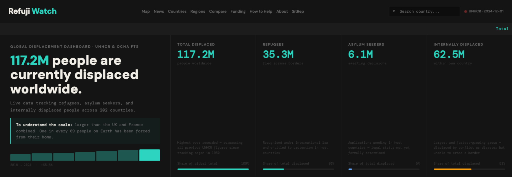
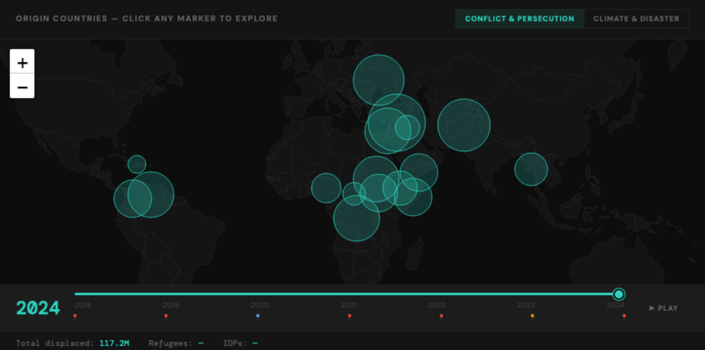

# Refuji Watch

A global displacement dashboard built on open humanitarian data from UNHCR, OCHA FTS and IDMC.



UNHCR publishes comprehensive displacement statistics. OCHA tracks every humanitarian dollar. IDMC counts people displaced by disasters. The data exists — but the tools to explore it are slow, dense and built for specialists. Refuji Watch turns those datasets into something a journalist, researcher, student or caseworker can actually read.

---

## Pages

| Page | What it shows |
|---|---|
| `index.html` | Global totals, an interactive world map of origin countries by year, displacement trends and live ReliefWeb headlines |
| `countries.html` | Searchable index of every country in the dataset |
| `country.html` | Per-country profile — origin and host figures, trends, demographics, funding |
| `regions.html` | Six regional overviews, each with its own map and crisis breakdown |
| `compare.html` | Side-by-side comparison of countries |
| `funding.html` | Humanitarian appeals against funding actually received |
| `sitrep.html` | Situation report generator (needs a backend — see below) |
| `about.html` / `help.html` | Project background, and ways to help |

### The map



Markers are scaled to displacement volume and stepped through year by year. Two layers: **conflict & persecution** (UNHCR — a stock, the total displaced at a point in time) and **climate & disaster** (IDMC — a flow, new displacements within each year, so figures reset annually).

The basemap is drawn from `world.json`, a set of Natural Earth 110m country outlines rendered as Leaflet vectors. There are no raster tiles, so no API key, no tile host and no usage quota.

---

## Data sources

| Source | Provides |
|---|---|
| [UNHCR Refugee Data Finder](https://www.unhcr.org/refugee-statistics) | Refugees, asylum seekers, IDPs; origin and host totals; trends from 2018 |
| [OCHA Financial Tracking Service](https://fts.unocha.org) | Appeal requirements and funding received |
| [IDMC Global Displacement Database](https://www.internal-displacement.org) | New displacements from disasters and conflict |
| [ReliefWeb](https://reliefweb.int) | Live humanitarian headlines (fetched in-browser) |

All are free and open — no API keys.

Some figures are pinned rather than live. UNHCR's demographics endpoint currently returns nothing, so `fetch_data.py` falls back to baselines extracted from the Global Trends annex tables (`demographics_baseline.json`, `demographics_hosts_baseline.json`, 2021). Each block in `sample.json` carries its own vintage under `data_vintages` — check it before citing a number.

---

## Running locally

You need Python 3 and `requests`:

```bash
pip3 install requests
```

The pages fetch their data from root-absolute paths (`/sample.json`, `/world.json`, `/basemap.js`), so serve the repository root — opening the HTML files directly with `file://` will not work, as the browser blocks those fetches.

```bash
git clone https://github.com/jahitjanberk/refuji-watch.git
cd refuji-watch
python3 -m http.server 8000
```

Then visit <http://localhost:8000>.

To refresh the data, run the pipeline from the repository root — it rewrites `sample.json` in place:

```bash
python3 fetch_data.py
```

One local-only quirk: the live news panel on the dashboard will show a fetch error, because ReliefWeb's CORS policy rejects `localhost`. It works once deployed.

---

## Layout

```
├── index.html, countries.html, country.html, regions.html,
│   compare.html, funding.html, sitrep.html, about.html, help.html
├── basemap.js                        # vector basemap for Leaflet
├── world.json                        # Natural Earth 110m country outlines
├── fetch_data.py                     # UNHCR + OCHA FTS + IDMC pipeline
├── sample.json                       # pipeline output — what the pages read
├── demographics_baseline.json        # UNHCR annex fallbacks
├── demographics_hosts_baseline.json
└── stories.json                      # background narratives, 14 crisis countries
```

No build step and no framework. Every page is standalone HTML with its CSS and JavaScript inline.

Third-party includes, all from CDNs: Leaflet (the maps), Google Fonts (DM Sans and DM Mono), a YouTube embed of UN Web TV on the dashboard, and a Cloudflare Web Analytics beacon on every page — remove that last one if you fork this and would rather not collect the traffic.

---

## Deployment

Any static host will serve this as-is, provided the repository root is the web root.

The site previously ran on AWS (S3, CloudFront, Route53, Lambda). That infrastructure has been decommissioned and the Terraform stack removed, so there is currently no deployment target wired up.

### SitRep generator

`sitrep.html` assembles a situation report from the dataset and sends it to an LLM for drafting. It needs a backend, since the API call cannot be made from the browser without exposing a key. Set `SITREP_API` near the top of the page's script to an endpoint that accepts `{prompt}` and returns `{content}`. Left empty, the page says so rather than failing obscurely. The AWS Lambda that used to serve this is gone.

---

## Contributing

Issues and pull requests are welcome — data problems especially. If a figure looks wrong, check `data_vintages` in `sample.json` first; it is often a vintage mismatch rather than a bug.

---

## License

MIT — free to use, share and adapt with attribution.

Data belongs to UNHCR, OCHA and IDMC, under their respective terms.
